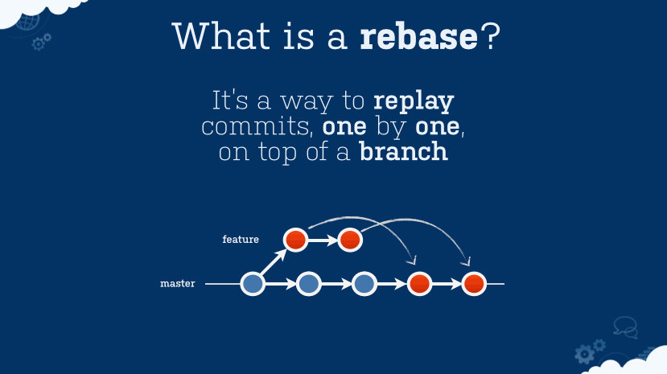
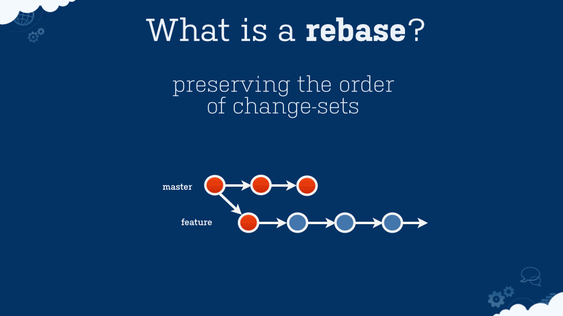

# A Collaborative Process for Git
From the official GitHub Flow guide:
> Branching is a core concept in Git, and the entire GitHub Flow is based upon it.
> There's only one rule: anything in the main branch is always deployable.

All changes should always be made in a branch created from main. Working in and merging changes within the main branch will inevitably lead to conflicts while working with others. For best results, use consistent and meaningful branch name prefixes like `fix/bug-name`, `feat/feature-name`, or `chore/task-name`.

Following the process improves everybody's workflow both independently and collectively. It enforces good documentation, backups, and prevents common merge conflicts while working with others. It aligns with the official [GitHub Flow guide](https://guides.github.com/introduction/flow/), _"a lightweight, branch-based workflow that supports teams and projects where deployments are made regularly."_

:metal:
***

## Pre-Pull Request

Use rebase to make the history as understandable and clear as possible [[guide](https://git-scm.com/book/en/v2/Git-Tools-Rewriting-History)]:

* Update with contents of main
* Squash commits together
* Separate single commits into multiple ones
* Reorder commits
* Remove commits
* Alter commit messages
* Force push changes to your branch (the only time force push is okay; *never* force push to main)

## Post-Pull Request

* Commit and push to your branch to address feedback from code review/visual testing

## Pre-Merge

* Do one large rebase to bring your branch up-to-date with main
* Do not push the rebased version — keeps commentary history
* Explicitly merge with main using `—no-ff` [What is the difference between `git merge` and `git merge --no-ff`?](http://stackoverflow.com/questions/9069061/what-is-the-difference-between-git-merge-and-git-merge-no-ff)
* This merge commit indicates a feature has landed

I found these animations from [an Atlassian blog post](http://blogs.atlassian.com/2014/01/simple-git-workflow-simple/) to be the best visual representation.

## Workflow

1. Get assigned issue on GitHub / Atlassian / Issue Tracker.
	* `git checkout main`
	* `git pull origin main`
	* `git checkout -b fix/bug-name` (Create feature branch for bug fixes)
	* `git checkout -b feat/feature-name` (Create feature branch for new features)
	* `git checkout -b chore/task-name` (Create feature branch for chores or tasks)
2. Work on feature; commit/push to this unique branch often.
3. Prep for main update by fetching the latest main from origin and placing your code on top of it within your own branch.
	* `git fetch`
	* `git rebase origin/main -i`
	* `git push origin fix/bug-name -f`
	* `git push origin feat/feature-name -f`
	* `git push origin chore/task-name -f`
4. If submitting Pull Request for code review:
	* Open a Pull Request
	* Respond to PR feedback (commit and push only)
5. Merge:
	* `git checkout main`
	* `git merge fix/bug-name`
	* `git merge feat/feature-name`
	* `git merge chore/task-name`
6. If Pull Request submitted:
	* Close PR and link merge commit SHA in comment
7. Close relevant issue and link merge commit SHA in comment
8. Delete branches:
	* From local: `git branch -D fix/bug-name`
	* From local: `git branch -D feat/feature-name`
	* From local: `git branch -D chore/task-name`
	* From remote: `git push origin --delete fix/bug-name`
	* From remote: `git push origin --delete feat/feature-name`
	* From remote: `git push origin --delete chore/task-name`
	* Or include the following script in your .bashrc / .zshrc file that deletes both simultaneously:
		+ 	`deleteBranch(){ git branch -D $1; git push origin --delete $1 }`
		+	`$ deleteBranch fix/bug-name`
		+	`$ deleteBranch feat/feature-name`
		+	`$ deleteBranch chore/task-name`

## Merging

* `git fetch`
* `git checkout fix/bug-name`
* `git checkout feat/feature-name`
* `git checkout chore/task-name`
* `git rebase origin/main`
* …resolve any conflict…
* `git checkout main`
* `git reset --hard origin/main`
* `git merge --no-ff fix/bug-name`
* `git merge --no-ff feat/feature-name`
* `git merge --no-ff chore/task-name`
* …there should be no conflicts at this point since they were resolved already…
* …make sure you can build, no warnings, etc…
* `git push origin main`

## Escape Hatches

* `git rebase --abort` while rebasing
* `git reset --hard ORIG-HEAD` after rebasing
* `git reflog` if you accidentally delete something you don’t mean to
